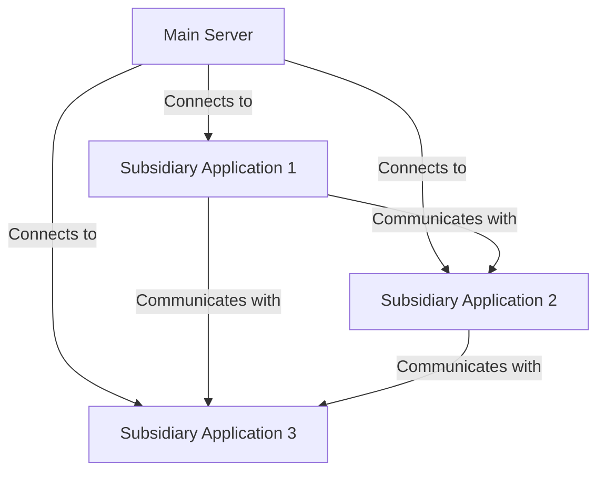
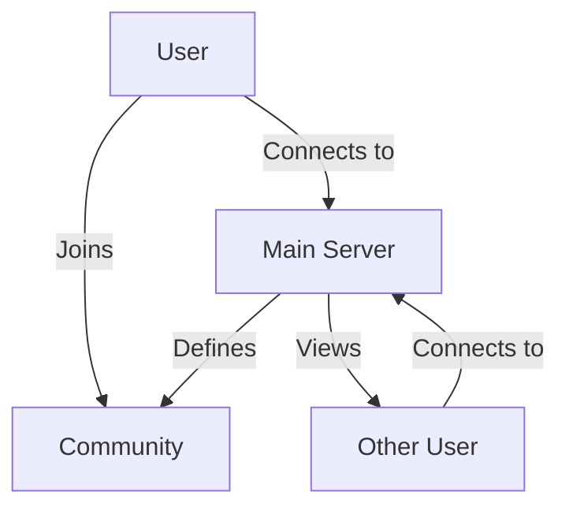
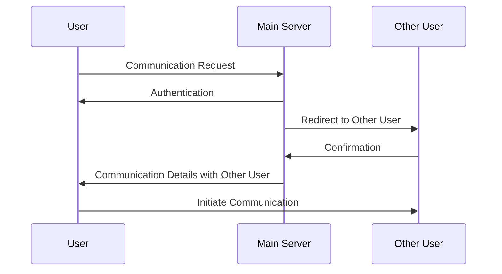

# world.social

## Overview

The project aims to create a decentralized social networking platform that provides users with a personalized feed curated from the accounts they follow. Unlike traditional centralized social networks, this platform is designed to be decentralized with multiple nodes serving as hubs. Users can communicate with each other directly or through these nodes, fostering a distributed and community-driven ecosystem.

## Key Features

- **Decentralized Architecture**: The platform operates on a decentralized architecture, reducing reliance on central servers and promoting user autonomy.
- **Personalized Feeds**: Users receive a customized feed comprising posts from accounts they follow, ensuring relevant content consumption.
- **Node Hierarchy**: The platform consists of main hubs akin to central offices, with subsidiary nodes branching out from them, mimicking the structure of administrative regions.
- **Inter-Node Communication**: Users can interact with each other and with nodes, facilitating seamless communication across the network.
- **Community Engagement**: Users can join communities directly or through referrals, each with its own set of rules and guidelines.
- **Trust-based Communication**: Communication between users is two-tiered, with initial interaction facilitated through the main hub and direct contact established upon mutual trust.

## Components

The project comprises the following components:

1. **Main Application**: Acts as the central hub responsible for managing user data, authentication, and overall network coordination. This component's source code will be closed, ensuring the integrity and security of the core system.
2. **Subsidiary Applications**: These are auxiliary nodes connected to the main application, serving as access points for users and facilitating communication within specific regions or communities.
3. **Community Platforms**: Users can form and join communities, each with its own platform for discussion, content sharing, and collaboration. These platforms adhere to community-specific rules and guidelines.

## Flow Diagrams

In the following diagrams, we illustrate the relationships between the main server, subsidiary applications, users, and communities, as well as the communication flow between these entities.

### Relationship between Main Server and Subsidiary Applications:

The main server connects to subsidiary applications, which in turn communicate with each other.

### Relationship between User and Community:

Users can join communities, which are managed by the main server.

### Communication Flow:

The following sequence diagram illustrates the communication flow between a user, the main server, and another user.

## Communication Protocol

The platform employs a secure communication protocol for interaction between nodes and users. Communication channels are encrypted to ensure privacy and security.

## Open Source

The project is open source, promoting transparency, collaboration, and community involvement. Developers are encouraged to contribute to the project by improving existing features, proposing new ideas, and addressing issues.

## Getting Started

To get started with the platform, follow these steps:

1. **Install Dependencies**: Ensure you have all the necessary dependencies installed on your system.
2. **Clone Repository**: Clone the project repository from GitHub.
3. **Set Up Environment**: Set up your development environment according to the provided guidelines.
4. **Contribute**: Contribute to the project by submitting pull requests, addressing issues, or proposing new features.

## License

The project is licensed under the [Apache License, Version 2.0](LICENSE), allowing for free use, modification, and distribution.

## Support

For support or inquiries, please contact [contact@9ssi7.dev](mailto:contact@9ssi7.dev).